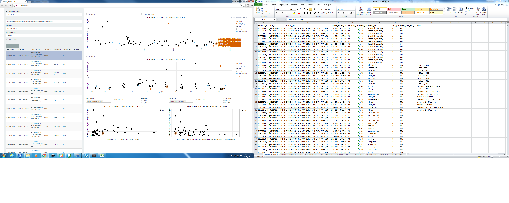
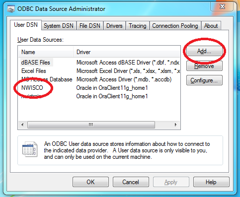
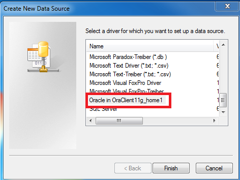
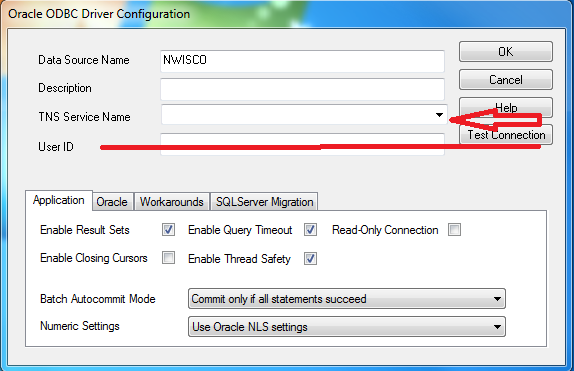

WQReview
----------

This is version 2.0 of the WQReview package. This new implementation has several bug fixes, and updated features including:
* Ability to auto-generate batch files for changing DQI codes through QWDATA.
* Modified Shiny GUI to group useful parameter plots into a single webpage.
* Auto-generated Microsoft Excel workbook with data tables for review, generated from Shiny GUI.
* Bug fixes based on user-identified issues.

DO NOT CHANGE DATA IN YOUR DATABASE USING THIS PROGRAM WITHOUT CAREFUL SCRUTINY. It is strongly recommended that you use the "verify only" option to test data load before making any real changes.

Please view this [Workflow Video](https://drive.google.com/file/d/1ljb82pTLF_N4jh-n_LGO-_8bymAmvtgf/view?usp=sharing) from original developer T.Joe Mills.

Toolbox for discrete water-quality data review and exploration. Users are encouraged to post any bugs or comments for additional functionality on the issues page at:

[WQ-Review Issues](https://github.com/USGS-R/WQ-Review/issues).

You may also contact WQReview Help at gs-w_wqreview_help@usgs.gov 

This package facilitates data review and exploration of discrete water-quality data through rapid and easy-to-use plotting functions and tabular data summaries. Data is imported with user-specified options for single or multiple sites and parameter codes using an ODBC connection to the user's local NWIS server. A graphical user interface allows the user to easily explore their data through a variety of graphical and tabular outputs. 

Requirements
----------

* This application requires a functioning 32 bit ODBC connection to an NWIS server. Guidance for setting up ODBC access is provided at the bottom of this page.
* Windows 7, 8, or 10
* **Google Chrome is required and must be set as the system default browser.**

Bug reporting and enhancements
----------

Please report any issues with the application or R package on the issues page at:

[WQ-Review Issues](https://github.com/USGS-R/WQ-Review/issues). 

Additionaly, please feel free to post any suggestions or enhancement requests.

**Your participation will make this a better tool for everyone!**

WQReview GUI User Guide
----------
[WQReviewGUI User Guide](vignettes/WQReviewGUI2.md)

Frequently asked questions
----------

[FAQ](vignettes/faq2.md)

Installation for stand alone application (non-R users)
----------

1. Download the install executable from FTP:

ftp://ftpint.usgs.gov/private/cr/co/lakewood/WQReview_EXE/

2. Run WQReviewInstall_2.0.exe and follow the installation instructions.

**DO NOT INSTALL WQ-REVIEW INTO YOUR PROGRAM FILES DIRECTORY OR THE APPLICATION WILL NOT RUN. INSTALL TO C DRIVE OR YOUR DOCUMENTS FOLDER.**

3. Make sure Google Chrome is set as the system default browser (settings -> Default browser)

4. Launch WQ-Review from the start-menu or desktop icon. A DOS window will appear first and then the application should launch in Google Chrome. **DO NOT CLOSE THIS DOS PROMPT, IT IS PART OF THE APPLICATION**

Guidance for setting up ODBC connection to NWIS
----------

Your database administrator or IT specialist may need to assist with these steps.

## Step 1
You need to setup a user Data Source Name (User DSN).

On 64bit Windows 7 and 8, run "C:/Windows/SysWOW64/odbcad32.exe".

On 32bit Windows 7 and 8, run "C:/Windows/System32/odbcad32.exe".

On 64bit Windows 10, in an explore window, paste "Control Panel/All Control Panel Items/Administrative Tools" and select "ODBC Data Sources (32-bit)"

In the User DSN tab, if you do not see a connection with the same name as your NWIS server of interest, you must add a new connection. Click "Add" on the right.

## Step 2
Scroll down until you see a driver named "Oracle in OraClient11g_home1" and click "Finish". **IF YOU DO NOT SEE THE ABOVE DRIVER LISTED, IT IS NOT INSTALLED AND YOU WILL NEED ASSISTANCE FROM AN IT SPECIALIST TO INSTALL IT, THE LINK TO GUIDANCE IS PROVIDED BELOW**

## Step 3
A new dialogue will appear. Click the dropdown box next to "TNS Service Name" and select the NWIS server you would like to connect to. After selecting the server, type in the server name into the "Data Source Name" text box at the top. **DO NOT ENTER A USER ID, LEAVE THIS FIELD BLANK**. You are finished, click OK to close the dialogue and then click OK in the main ODBC Data Source Administrator application to close the application.

If you do not have the driver installed, contact your local IT staff
----------

Install the Oracle client by following the instructions here:

http://nwis.usgs.gov/IT/INSTRUCT/HOWTO/DB_oracle_odbc.html

The ODBC connection must be setup for Oracle and in 32-bit mode

## Disclaimer
[Disclaimer](DISCLAIMER.md)
