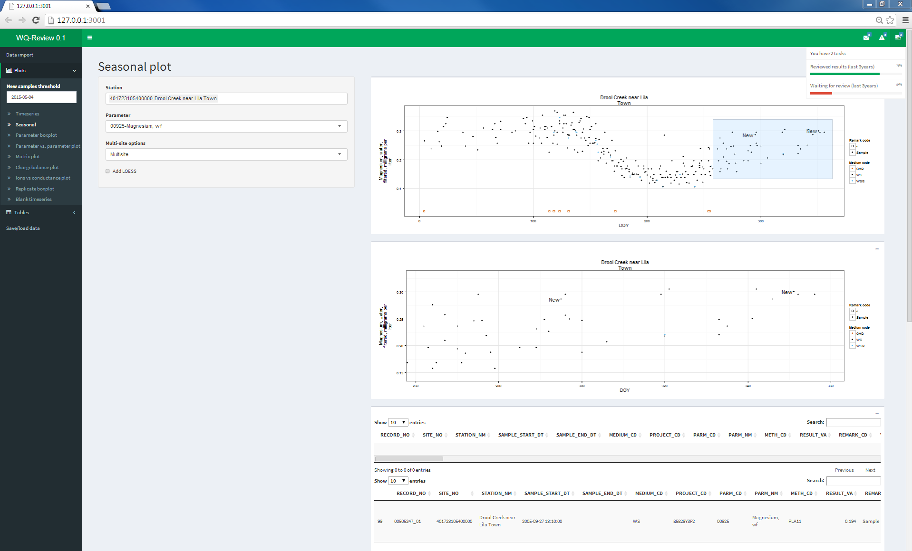

`WQReview`
==========
## Overview
Toolbox for discrete water-quality data review and exploration.

## Package Status

[](https://owi.usgs.gov/R/packages.html#support)
This package is considered a 'support' package. For more information, see:
[https://owi.usgs.gov/R/packages.html#support](https://owi.usgs.gov/R/packages.html#support)

### Build Status
[](https://ci.appveyor.com/project/tmills-usgs/wq-review-6hgb9)

### Reporting Bugs
Users are encouraged to post any bugs or comments for additional functionality on the issues page at:
[WQ-Review Issues](https://github.com/USGS-R/WQ-Review/issues) 
You may also contact the maintainer at cpenn@usgs.gov

## Description
This package facilitates data review and exploration of discrete water-quality data through rapid and easy-to-use plotting functions and tabular data summaries. Data is imported with user-specified options for single or multiple sites and parameter codes using an ODBC connection to the user's local NWIS server. A graphical user interface allows the user to easily explore their data through a variety of graphical and tabular outputs. 



## System Requirements
* This application requires a functioning 32 bit ODBC connection to an NWIS server. Guidance for setting up ODBC access is provided at the bottom of this page.
* Windows 7,8, or 10
* **Google Chrome is required and must be set as the system default browser.**

### Bug reporting and enhancements
Please report any issues with the application or R package on the issues page at:
[WQ-Review Issues](https://github.com/USGS-R/WQ-Review/issues) 

Additionaly, please feel free to post any suggestions or enhancement requests.
**Your participation will make this a better tool for everyone!**

## Frequently Asked Questions: [FAQ](vignettes/faq.Rmd)

## Installation for stand alone application (non-R users)

1. Download the application at

ftp://ftpint.usgs.gov/private/cr/co/lakewood/tmills/wqReviewSetup.exe

2. Run wqReviewSetup.exe and follow the installation instructions.

**DO NOT INSTALL WQ-REVIEW INTO YOUR PROGRAM FILES DIRECTORY OR THE APPLICATION WILL NOT RUN. INSTALL TO C DRIVE OR YOUR DOCUMENTS FOLDER.**

3. Update WQ-Review to the latest version either by clicking the checkbox at the end of the setup, or by going to Startmenu->Programs->WQ-Review->Update. A command prompt window will appear and stay open until the update is complete. When the update is complete it will close with no other prompts.

4. Make sure Google Chrome is set as the system default browser (settings -> Default browser)

5. Launch WQ-Review from the start-menu or desktop icon. A DOS window will appear first and then the application should launch in Google Chrome. **DO NOT CLOSE THIS DOS PROMPT, IT IS PART OF THE APPLICATION**


## Installation for R users
### Step 1. Switch over to 32-bit R.

R must be run in 32-bit mode to use the ODBC driver. Open R-studio and click Tools-Global Options on the top toolbar. Under "General" in the global options dialog, you will see "R version:" at the top. Click "Change" next to the R version and select "Use your machine's default version of R (32 bit)" to change to 32-bit R. R-studio will need to restart after doing this.

### Step 2. Install the WQ-Review package from GRAN.

Open R-studio in 32-bit mode if it is not already open and type the following commands in the console:

```R
install.packages("WQReview", repos=c("http://owi.usgs.gov/R","http://cran.us.r-project.org"))
```

This will install the WQ-Review package as well as all other packages that WQ-Review relies on. It may take a minute to download and install the supporting packages during the first installation.


### Run the app
The shiny app is launched by loading the WQ-Review package and running the function 
```
library(WQReview)
WQReviewGUI()
```
## Guidance for setting up ODBC connection to NWIS
Your database administrator or IT specialist will may need to assist for these steps.

### Step 1
You need to setup a user Data Source Name (User DSN).

On 64bit Windows 7 and 8, run "C:/Windows/SysWOW64/odbcad32.exe".

On 32bit Windows 7 and 8, run "C:/Windows/System32/odbcad32.exe".

On 64bit Windows 10, in an explore window, paste "Control Panel/All Control Panel Items/Administrative Tools" and select "ODBC Data Sources (32-bit)"

In the User DSN tab, if you do not see a connection with the same name as your NWIS server of interest, you must add a new connection. Click "Add" on the right.


### Step 2
Scroll down until you see a driver named "Oracle in OraClient11g_home1" and click "Finish". **IF YOU DO NOT SEE THE ABOVE DRIVER LISTED, IT IS NOT INSTALLED AND YOU WILL NEED ASSISTANCE FROM AN IT SPECIALIST TO INSTALL IT, THE LINK TO GUIDANCE IS PROVIDED BELOW**


### Step 3
A new dialogue will appear. Click the dropdown box next to "TNS Service Name" and select the NWIS server you would like to connect to. After selecting the server, type in the server name into the "Data Source Name" text box at the top. **DO NOT ENTER A USER ID, LEAVE THIS FIELD BLANK**. You are finished, click OK to close the dialogue and then click OK in the main ODBC Data Source Administrator application to close the application.


### If you do not have the driver installed
Install the Oracle client by following the instructions here:

http://nwis.usgs.gov/IT/ORACLE/Oracle.client.installation.htm

Then follow the instructions to setup the system DSN

http://nwis.usgs.gov/IT/INSTRUCT/HOWTO/DB_oracle_odbc.html

The ODBC connection must be setup for Oracle and in 32-bit mode

## Disclaimer
This software is in the public domain because it contains materials that originally came from the U.S. Geological Survey, an agency of the United States Department of Interior. For more information, see the [official USGS copyright policy](https://www2.usgs.gov/visual-id/credit_usgs.html#copyright)

Although this software program has been used by the U.S. Geological Survey (USGS), no warranty, expressed or implied, is made by the USGS or the U.S. Government as to the accuracy and functioning of the program and related program material nor shall the fact of distribution constitute any such warranty, and no responsibility is assumed by the USGS in connection therewith.

This software is provided "AS IS."

 [
    
  ](http://creativecommons.org/publicdomain/zero/1.0/)

