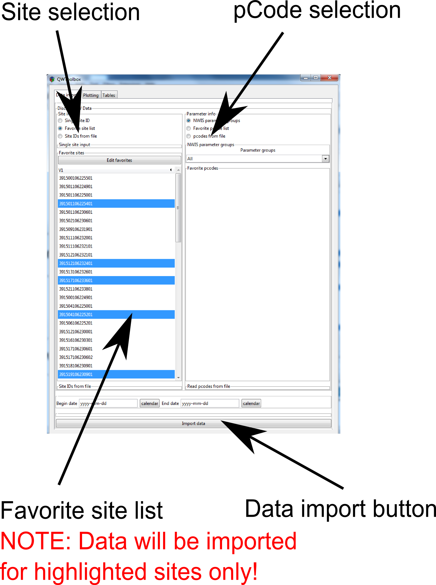
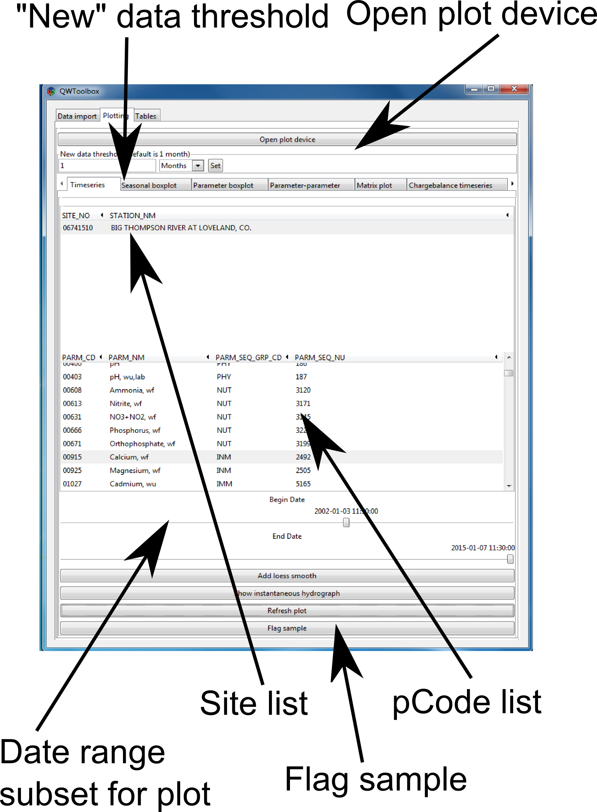
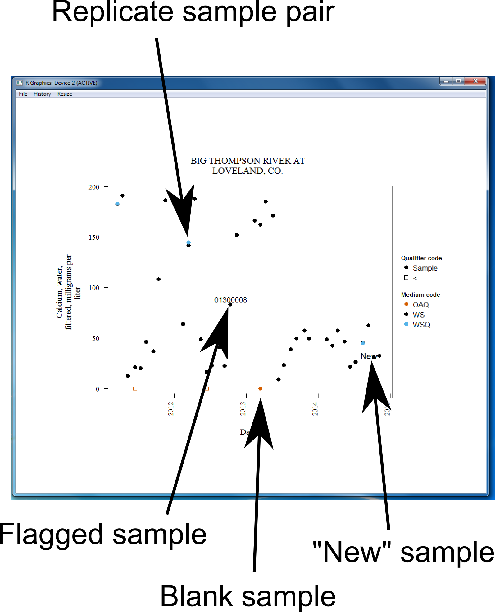

This gives a brief overview of the WQReview Graphical User Interface (GUI). Additional vignettes describe the
GUI operation in more detail. Additionally, see the vignette "Example workflow" for a step-by-step process for basic data review using the WQReview. There is also a companion video for the "Example workflow" that walks the user through a the same basic data review using an example dataset.

## Opening the WQReview GUI

Open R-studio in 32-bit mode and select file -> New Project...
Create a new project for the dataset you are working with. For example, New directory -> Empty Project -> Directory
name -> "Arkansas River Basin". This creates a new R project and directory titled "Arkansas River Basin". All files created through WQReview will be stored in this folder.

Load the WQReview package by typing the following in the script window and running:

```R
library(WQReview)
```

This has loaded the WQReview package and now you can run the WQReview() function to start the gui. The WQReview() function call runs the GUI and a new window will appear containing the WQReview GUI. Favorite sites and pcodes can be read in as arguments to the WQReview function. You must enter the information for your local NWIS server as arguments to the function. For example in Colorado:


```R
WQReview(siteids = "mysiteIDs.csv", pcodes = "mypcodes.csv",
          dlserver.name = "NWISCO", env.db.num = "01", qa.db.num = "02")
```
For help with the WQReview() function arguments, type the following in the R console:

```R
?WQReview
```

You may now work mostly from this GUI window.

### A note on file types used by WQReview
WQReview takes .csv files as inputs. These .csv files can be made in MS Excel or any text editor of your choosing. Each entry is on its own line, and columns are delimited by commas. Tables are exported from WQReview as tab-delimited text files that can be easily opened in MS Excel.


## Overview of WQReview GUI

The WQReview GUI currently has 3 primary tabs.

1. Dataimport
1. Tables
1. Plotting

These 3 tabs reflect the general workflow for QAQC of water-quality data using WQReview.

### Data import tab

The data import tab has 4 main panes:

1. Site Selection: This pane selects the method of site ID input. You can manually type in a single site ID, you can pick from a favorites list imported when you started WQReview, or you can read IDs in directly from a csv file.
    
1. pCode selection: This pane selects the method of pCode input. You can select from NWIS parameter groups, you can pick from a favorites list imported when you started WQReview, or you can read pCodes in directly from a csv file.

1. Favorite site list: This is the list of site IDs read in when you started WQReview. You can import data for one or multiple of your favorites by clicking them to highlight. You can select multiple sites from the list using ctrl-click or shift-click. 

     DATA WILL NOT BE IMPORTED IF SITES ARE NOT HIGHLIGHTED!

1. Favorite pCode list: This functions exactly the same as the favorite site list.

     DATA WILL NOT BE IMPORTED IF PCODES ARE NOT HIGHLIGHTED!



Once the user has selected sites and pcodes the data can be imported by clicking the "Import data" button. Data can be subset to a date range using the date inputs above the button. If these inputs are left as-is it will pull all data. 

DATES MUST BE IN yyyy-mm-dd FORMAT!

###Tables tab

The tables tab is where you can view tables in the GUI or output tables to tab-delimited files for import into MS Excel.
The table viewer in the WQReview gui allows for some basic sorting and viewing of data. However, with the current functionality it is recommended that the user export all tables to tab delimited files.

It can also be used to look up information on a specific record. 

WQReview currently generates 5 tables:

1. Datatable - This is just a raw export of all the data pulled in wide format.

1. Summary of data flags - This is a table summarizing the various QAQC check table generated by WQReview.

1. Chargebalance table - This is a summary table of the charge balance.
     There is a column "flags" at the end of the table that contains flags for samples where the charge imbalance is > 5% or > 10%.
     
1. Replicate table - This is a table of replicate analyses.
     Results for environmental and replicate samples are paired and the relative percent difference is calculated. If the relative percent difference is > 10% it gets flagged, and gets an additional flag if the RPD is also greater than the reporting limit. For samples near the reporting limit, a difference of >10% may be acceptable if that difference is still less than the reporting limit. 

1. Blank summary by level - This is a summary table of blank analyses split by reporting level. Blank analyses are grouped according to reporting level and summary statistics are calculated. The BD90.90 value is a suggested value to set a study reporting limit if there are multiple blank detections. See INCLUDE REFERENCE for details on the BD90.90 method. 
     
1. Blank summary all - This is a summary table of blank analyses not split by reporting level. All blank analyses are grouped together regardless of reporting level and summary statistics are calculated. The BD90.90 value is a suggested value to set a study reporting limit if there are multiple blank detections. See INCLUDE REFERENCE for details on the BD90.90 method. 

1. Part vs. whole table - This is a table of whole vs part analysis checks. 
     There is also a column for flags in this table. Results where the filtered parameter is greater than the unfiltered parameter are flagged as long as the difference is greater than the reporting limit of the least precise method. The sample is flagged with an extra flag if that difference between filtered and unfiltered is also > 10%. This helps account for small differences in high concentration samples.
     

     
###Plotting tab
 
The plotting tab is where all plots can be controlled. There is a button at the top of the tab notebook called "Open plot device". This button will open another window where all plots will appear. This plot window can be used to save plots as well. There is also a slider and button to set the "New data" threshold. This will cause any samples that have been modified after the set threshold date to be flagged as "New". For example, the default setting is 1 month and any sample that has been modified in the last month will be labeled "New" on plots.

The site and parameter selection lists operate the same as in the data import tab. Most plots will refresh automatically with a change in site or parameter, but some require the user to press the "refresh plot" button at the bottom of the plotting pane. 

A SITE OR PARAMETER MUST BE HIGHLIGHTED FOR THE PLOT TO GENERATE, EVEN IF ONLY ONE SITE OR ONE PARAMETER IS PRESENT IN THE LIST. 




Timeseries plots can be zoomed in or out based on date range using the two date sliders. The plot will not automatically refresh using this and the user must hit the "Refresh plot" button.

Sample points on plots are generally color coded by medium code and the symbol shape is set by the remark code. This allows for a very quick analysis of reps vs environmental samples and blanks. It also makes identifying miscoded samples very easy, such as a WS coded as a WG or a OAQ coded as a WSQ.


 

###Saving/loading datasets

A WQReview dataset can be saved by clicking the disk icon in the top toolbar of WQReview. This will save the file with the specified name in a folder in your working directory called "SavedToolboxes". The saved toolbox can be loaded later with all of the stored preferences such as site IDs, pcodes, and new threshold limits. This is a useful tool in that a) you do not need to re-import data every time you open the toolbox if you are certain no changes to NWIS have been made, and b) you can continue working with your data even if you do not have a connection to NWIS.
