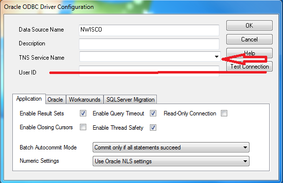

#Introduction
Toolbox for discrete water-quality data review and exploration.Users are encouraged to post any bugs or comments for additional functionality on the issues page at:

[WQ-Review Issues](https://github.com/USGS-R/WQ-Review/issues).

This package facilitates data review and exploration of discrete water-quality data through rapid and easy-to-use plotting functions and tabular data summaries. Data is imported with user-specified options for single or multiple sites and parameter codes using an ODBC connection to the user's local NWIS server. A graphical user interface allows the user to easily explore their data through a variety of graphical and tabular outputs. 


##Requirements
* This application requires a functioning 32 bit ODBC connection to an NWIS server. Guidance for setting up ODBC access is provided at the bottom of this page.
* **Google Chrome is required and must be set as the system default browser.**

##Bug reporting and enhancements
Please report any issues with the application or R package on the issues page at:

[WQ-Review Issues](https://github.com/USGS-R/WQ-Review/issues). 

Additionaly, please feel free to post any suggestions or enhancement requests.

**Your participation will make this a better tool for everyone!**

##Installation for stand alone application (non-R users)

1. Download the application at

ftp://ftpint.usgs.gov/private/cr/co/lakewood/tmills/wqReviewSetup.exe

2. Run wqReviewSetup.exe and follow the installation instructions.

**DO NOT INSTALL WQ-REVIEW INTO YOUR PROGRAM FILES DIRECTORY OR THE APPLICATION WILL NOT RUN. INSTALL TO C DRIVE OR YOUR DOCUMENTS FOLDER.**

3. Update WQ-Review to the latest version either by clicking the checkbox at the end of the setup, or by going to Startmenu->Programs->WQ-Review->Update. A command prompt window will appear and stay open until the update is complete. When the update is complete it will close with no other prompts.


##Installation for R users
###Step 1. Switch over to 32-bit R.

R must be run in 32-bit mode to use the ODBC driver. Open R-studio and click Tools-Global Options on the top toolbar. Under "General" in the global options dialog, you will see "R version:" at the top. Click "Change" next to the R version and select "Use your machine's default version of R (32 bit)" to change to 32-bit R. R-studio will need to restart after doing this.

###Step 2. Install the "devtools" package for installing WQ-Review directly from Github.

Open R-studio in 32-bit mode if it is not already open and type the following command in the console:
```R
install.packages(c("curl","devtools"))
```
This will install the devtools package on your machine. 

If an error appears about "Rtools not installed", ignore this message, Rtools is not required for the devtools functions you will use.

###Step 3. Install the WQ-Review package from Github.

Open R-studio in 32-bit mode if it is not already open and type the following commands in the console:

```R
library(devtools)
install_github("USGS-R/WQ-Review",build_vignettes = TRUE)
```

This will install the WQ-Review package as well as all other packages that WQ-Review relies on. It may take a minute to download and install the supporting packages during the first installation.


###Run the app
The shiny app is launched by loading the WQ-Review package and running the function 
```
library(WQReview)
WQReviewGUI()
```
##Guidance for setting up ODBC connection to NWIS
Your database administrator or IT specialist will may need to assist for these steps.

###Step 1
You need to setup a user Data Source Name (User DSN).
On 64bit Windows 7 and 8, run "C:/Windows/SysWOW64/odbcad32.exe".

On 32bit Windows 7 and 8, run "C:/Windows/System32/odbcad32.exe".

In the User DSN tab, if you do not see a connection with the same name as your NWIS server of interest, you must add a new connection. Click "Add" on the right.


###Step 2
Scroll down until you see a driver named "Oracle in OraClient11g_home1" and click "Finish". **IF YOU DO NOT SEE THE ABOVE DRIVER LISTED, IT IS NOT INSTALLED AND YOU WILL NEED ASSISTANCE FROM AN IT SPECIALIST TO INSTALL IT, THE LINK TO GUIDANCE IS PROVIDED BELOW**


###Step 3
A new dialogue will appear. Click the dropdown box next to "TNS Service Name" and select the NWIS server you would like to connect to. After selecting the server, type in the server name into the "Data Source Name" text box at the top. **DO NOT ENTER A USER ID, LEAVE THIS FIELD BLANK**. You are finished, click OK to close the dialogue and then click OK in the main ODBC Data Source Administrator application to close the application.



###If you do not have the driver installed
Install the Oracle client by following the instructions here:

http://nwis.usgs.gov/IT/ORACLE/Oracle.client.installation.htm

Then follow the instructions to setup the system DSN

http://nwis.usgs.gov/IT/INSTRUCT/HOWTO/DB_oracle_odbc.html

The ODBC connection must be setup for Oracle and in 32-bit mode. 


#Importing Data
This will describe the process for importing data into the WQReview Graphical User Interface (GUI). We will start by importing data for a single site using predefined NWIS parameter groups.
##Load the WQReview package and open the WQReview GUI

1. Load the WQReview package by typing the following into your R script or command window:

```R
library(WQReview)
```

1. To open the GUI run the WQReviewGUI() function.

```R
WQReviewGUI()
```

The GUI window will open in your system's default internet browser. **It is recommended that the GUI be run in Google Chrome.** If the GUI opens in internet explorer, you need to change your system's default browser to Google Chrome by opening Google Chrome and going to settings -> default browser (bottom of page).

##Data import options

The data import tab has 10 main inputs. A description of the input is given when the input is hovered over with the mouse cursor.

1. **Site number**: This input takes a manually entered site number(s). Type the site number in and click "add". You may add as many site numbers as you would like. Remove a site number by clicking it and hitting the backspace or delete keys. Alternatively, click in the box and press the backspace key to incrementally remove the numbers starting with the last entry.
    
1. **Site number file**: This input takes a file of site IDs. The file must be a single column text file of site numbers.Make sure leading zero's have not been removed if using excel to generate the file.

1. **Parameter codes**: This input takes a manually entered parameter codes (pcodes). This behaves the same as the site number input.

1. **Parameter groups**: This input is used to select NWIS parameter groups to retrieve, rather than explicitly selecting individual pcodes.

1. **pCode file**: This input takes a file of pcodes. The file must be a single column text file of pcodes. Make sure leading zero's have not been removed if using excel to generate the file.

1. **Start date**: The start date for the data pull. Samples collected after this date will be retrieved. The default value is 10 years before the current date.

1. **End date**: The end date for the data pull. Samples collected before this date will be retrieved. The default is the current date.

1. **Server name (DSN)**: The name of your nwis server data source name (DSN) that was established during ODBC setup.

1. **Environmental DB number**: The number cooresponding to the environmental database. Default is "01"

1. **QA DB Number**: The number cooresponding to the QA sample database. Default is "02"

##A basic data import
We will start with a basic data import for a single site by parameter groups.

1. Double check that your server name and database numbers are correct for your data. 
1. Type a site ID into the site number input box and click "add".
1. Select "All" parameter groups from the Parameter groups select box to pull data for all parameters or select a specific group of parameters. **Beware, if pulling selected groups of parameters (e.g. "cations") chargebalance may not be able to be calculated.

1. Leave the date range input unchanged to pull the last 10 years of data or enter a date range in the date range input to pull a subset of the data.
1. Click the "Get data" button to import the data.
1. A dialogue box and status bar describing the import process will appear in the upper right corner of the GUI.
1. Once data has been retrieved, text will be displayed listing the results of the data import.

If you encounter issues with the data import, send an email to tmills@usgs.gov and/or post an issue on the WQReview GitHub page at [WQ-Review Issues](https://github.com/USGS-R/WQ-Review/issues)

We can now begin to work with the data.


