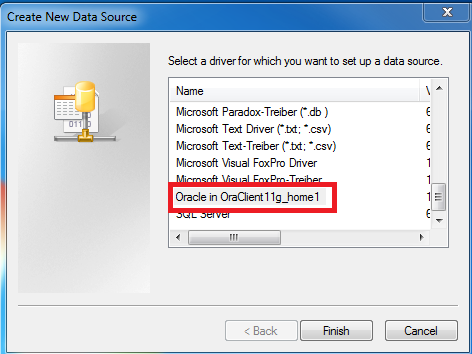

#Introduction
Toolbox for discrete water-quality data review and exploration.Users are encouraged to post any bugs or comments for additional functionality on the issues page at:

[WQ-Review Issues](https://github.com/USGS-R/WQ-Review/issues).

This package facilitates data review and exploration of discrete water-quality data through rapid and easy-to-use plotting functions and tabular data summaries. Data is imported with user-specified options for single or multiple sites and parameter codes using an ODBC connection to the user's local NWIS server. A graphical user interface allows the user to easily explore their data through a variety of graphical and tabular outputs. 


##Requirements
* This application requires a functioning 32 bit ODBC connection to an NWIS server. Guidance for setting up ODBC access is provided at the bottom of this page.
* **Google Chrome is required and must be set as the system default browser.**

##Bug reporting and enhancements
Please report any issues with the application or R package on the issues page at:

[WQ-Review Issues](https://github.com/USGS-R/WQ-Review/issues). 

Additionaly, please feel free to post any suggestions or enhancement requests.

**Your participation will make this a better tool for everyone!**

##Installation for stand alone application (non-R users)

1. Download the application at

ftp://ftpint.usgs.gov/private/cr/co/lakewood/tmills/wqReviewSetup.exe

2. Run wqReviewSetup.exe and follow the installation instructions.

**DO NOT INSTALL WQ-REVIEW INTO YOUR PROGRAM FILES DIRECTORY OR THE APPLICATION WILL NOT RUN. INSTALL TO C DRIVE OR YOUR DOCUMENTS FOLDER.**

3. Update WQ-Review to the latest version either by clicking the checkbox at the end of the setup, or by going to Startmenu->Programs->WQ-Review->Update. A command prompt window will appear and stay open until the update is complete. When the update is complete it will close with no other prompts.


##Installation for R users
###Step 1. Switch over to 32-bit R.

R must be run in 32-bit mode to use the ODBC driver. Open R-studio and click Tools-Global Options on the top toolbar. Under "General" in the global options dialog, you will see "R version:" at the top. Click "Change" next to the R version and select "Use your machine's default version of R (32 bit)" to change to 32-bit R. R-studio will need to restart after doing this.

###Step 2. Install the "devtools" package for installing WQ-Review directly from Github.

Open R-studio in 32-bit mode if it is not already open and type the following command in the console:
```R
install.packages(c("curl","devtools"))
```
This will install the devtools package on your machine. 

If an error appears about "Rtools not installed", ignore this message, Rtools is not required for the devtools functions you will use.

###Step 3. Install the WQ-Review package from Github.

Open R-studio in 32-bit mode if it is not already open and type the following commands in the console:

```R
library(devtools)
install_github("USGS-R/WQ-Review",build_vignettes = TRUE)
```

This will install the WQ-Review package as well as all other packages that WQ-Review relies on. It may take a minute to download and install the supporting packages during the first installation.


###Run the app
The shiny app is launched by loading the WQ-Review package and running the function 
```
library(WQReview)
WQReviewGUI()
```
##Guidance for setting up ODBC connection to NWIS
Your database administrator or IT specialist will may need to assist for these steps.

###Step 1
You need to setup a user Data Source Name (User DSN).
On 64bit Windows 7 and 8, run "C:/Windows/SysWOW64/odbcad32.exe".

On 32bit Windows 7 and 8, run "C:/Windows/System32/odbcad32.exe".

In the User DSN tab, if you do not see a connection with the same name as your NWIS server of interest, you must add a new connection. Click "Add" on the right.


###Step 2
Scroll down until you see a driver named "Oracle in OraClient11g_home1" and click "Finish". **IF YOU DO NOT SEE THE ABOVE DRIVER LISTED, IT IS NOT INSTALLED AND YOU WILL NEED ASSISTANCE FROM AN IT SPECIALIST TO INSTALL IT, THE LINK TO GUIDANCE IS PROVIDED BELOW**



###Step 3
A new dialogue will appear. Click the dropdown box next to "TNS Service Name" and select the NWIS server you would like to connect to. After selecting the server, type in the server name into the "Data Source Name" text box at the top. **DO NOT ENTER A USER ID, LEAVE THIS FIELD BLANK**. You are finished, click OK to close the dialogue and then click OK in the main ODBC Data Source Administrator application to close the application.


###If you do not have the driver installed
Install the Oracle client by following the instructions here:

http://nwis.usgs.gov/IT/ORACLE/Oracle.client.installation.htm

Then follow the instructions to setup the system DSN

http://nwis.usgs.gov/IT/INSTRUCT/HOWTO/DB_oracle_odbc.html

The ODBC connection must be setup for Oracle and in 32-bit mode. 


#Importing Data
This will describe the process for importing data into the WQReview Graphical User Interface (GUI). We will start by importing data for a single site using predefined NWIS parameter groups.
##Load the WQReview package and open the WQReview GUI

1. Load the WQReview package by typing the following into your R script or command window:

```R
library(WQReview)
```

1. To open the GUI run the WQReviewGUI() function.

```R
WQReviewGUI()
```

The GUI window will open in your system's default internet browser. **It is recommended that the GUI be run in Google Chrome.** If the GUI opens in internet explorer, you need to change your system's default browser to Google Chrome by opening Google Chrome and going to settings -> default browser (bottom of page).

##Data import options

The data import tab has 10 main inputs. A description of the input is given when the input is hovered over with the mouse cursor.

1. **Site number**: This input takes a manually entered site number(s). Type the site number in and click "add". You may add as many site numbers as you would like. Remove a site number by clicking it and hitting the backspace or delete keys. Alternatively, click in the box and press the backspace key to incrementally remove the numbers starting with the last entry.
    
1. **Site number file**: This input takes a file of site IDs. The file must be a single column text file of site numbers.Make sure leading zero's have not been removed if using excel to generate the file.

1. **Parameter codes**: This input takes a manually entered parameter codes (pcodes). This behaves the same as the site number input.

1. **Parameter groups**: This input is used to select NWIS parameter groups to retrieve, rather than explicitly selecting individual pcodes.

1. **pCode file**: This input takes a file of pcodes. The file must be a single column text file of pcodes. Make sure leading zero's have not been removed if using excel to generate the file.

1. **Start date**: The start date for the data pull. Samples collected after this date will be retrieved. The default value is 10 years before the current date.

1. **End date**: The end date for the data pull. Samples collected before this date will be retrieved. The default is the current date.

1. **Server name (DSN)**: The name of your nwis server data source name (DSN) that was established during ODBC setup.

1. **Environmental DB number**: The number cooresponding to the environmental database. Default is "01"

1. **QA DB Number**: The number cooresponding to the QA sample database. Default is "02"

##A basic data import
We will start with a basic data import for a single site by parameter groups.

1. Double check that your server name and database numbers are correct for your data. 
1. Type a site ID into the site number input box and click "add".
1. Select "All" parameter groups from the Parameter groups select box to pull data for all parameters or select a specific group of parameters. **Beware, if pulling selected groups of parameters (e.g. "cations") chargebalance may not be able to be calculated.

1. Leave the date range input unchanged to pull the last 10 years of data or enter a date range in the date range input to pull a subset of the data.
1. Click the "Get data" button to import the data.
1. A dialogue box and status bar describing the import process will appear in the upper right corner of the GUI.
1. Once data has been retrieved, text will be displayed listing the results of the data import.

If you encounter issues with the data import, send an email to tmills@usgs.gov and/or post an issue on the WQReview GitHub page at [WQ-Review Issues](https://github.com/USGS-R/WQ-Review/issues)

We can now begin to work with the data.


---
title: "WQReview GUI - working with interactive plots"
author: "T. Joe Mills"
date: "`r Sys.Date()`"
output:
  html_vignette:
    toc: true
    toc_depth: 4
            
vignette: >
  %\VignetteIndexEntry{WQReview GUI- working with interactive plots}
  %\VignetteEngine{knitr::rmarkdown}
  \usepackage[utf8]{inputenc}
---


#Plot descriptions
This section will describe the plot types available in the WQReview GUI and the various ways to manipulate them.

##Symbology
The symbology in all plots is sensitive to the medium code and remark code. Data colors are mapped to the medium code and point data symbols are mapped to the remark code. 

Currently supported medium codes include:

1. WS
1. WG
1. OA
1. WSQ
1. WGQ
1. OAQ

Currently supported remark codes include:

1. No remark code (listed as "Sample" in legend)
1. <
1. '>'
1. E

##Labelling conventions
All axis pertaining to a particular pcode will be labelled with that pcode's NWIS parameter name, which includes the units of measurement. The main title of the plot will either by labelled with the NWIS station name if only one station is plotted, or "multi-site plot" if multiple stations are displayed.

##Selecting data to plot
Generally, plots are controlled by selecting a site and then a data type from an input box or pick list. In most cases the plot will be displayed or refreshed automatically. **PLOTS WILL NOT BE DISPLAYED IF A SITE AND DATA TYPE ARE NOT SELECTED EVEN IF ONLY ONE SITE OR DATA TYPE IS PRESENT**. Additionally, a plot will not be displayed if there are no data to plot, for example if a particular parameter was not measured at a selected site but is selected for plotting. Multiple sites of multiple parameters can be plotted on certain plot types.

##Global plot controls

###New data threshold
Point data in all plots can be labeled as "New" data based off of when that data was last modified using the "New data threshold" slider. Any data modified after the date indicated on the slider will be labeled as "New". This helps identify data that has not been reviewed from historic data when the data are not displayed as a timeseries. Note that the "New data threshold" is set off of when the data were last **modified** for result-level plots (e.g. timeseries, seasonal, etc.) not when they were created. Sample-level plots (e.g. charge balance) are labeled new according to the sample collection date.

###Record highlights
Samples or results will be hilighted with a red halo if that sample or result has been flagged for one or more of the data checks listed in the data check table.

###Plot clicking, brushing, and hovering
Most plots are interactive in that the user can click on a point, or zoom into specific areas of the plot. Boxplots are not interactive. 

####Clicking
Clicking on a datapoint will populate a table with all data pertaining to that point. This table will persist until another point is clicked. 

####Brushing
The user may also select and area of the plot by holding down a mouse click and drawing a rectangle around hte area of interest. A new plot will appear below, zoomed into the area of interest. Additionaly, a table will be displayed below with all data pertaining to the points within the zoomed area. Points in the zoomed plot can also be click to get information. 

####Hovering
Hovering the mouse over any given data point will display basic information about the data point on the left sidebar of the plot frame.

##Plot types

This section will describe the details of each different plot type and how to control them in the WQReview GUI.

###Timeseries

This tab generates of plot of a selected parameter through time. 

####Uses
* Identifying general trends at a site through time.
* Identifying temporal outliers.

####Data selection options

* Select one or multiple sites
* Select only one parameter

####Plot controls
* Multi-site options: Plot all sites on one plot (multisite) or plot sites on individual side-by-side plots (facet).
* Add LOESS: Adds a locally weighted scatterplot smooth and shaded 95% confidence interval around the smooth
* Display hydrograph: displays the instantaneous hydrograph if data are available under parameter code "00061"

###Seasonal plot
This pane generates a seasonal timeseries of parameter value by day of year (DOY) to examine seasonality in parameter values.

####Uses
* Identifying seasonality in parameter values.
* Identifying seasonal outliers.

####Data selection options

* Select one or multiple sites
* Select only one parameter

####Plot controls

* Multi-site options: Plot all sites on one plot (multisite) or plot sites on individual side-by-side plots (facet).
* Add LOESS: Adds a locally weighted scatterplot smooth and shaded 95% confidence interval around the smooth

###Parameter box plot
This pane generates a box plot of one or more parameters for one or more sites. **Note that this is not an appropriate censored boxplot. Censored results are given the censored value for quantile calculations.**

####Uses
* Comparing parameter values at a site(s).
* Identifying outliers in a parameter. 

####Data selection options

* Select one or multiple sites
* Select one or multiple parameters


####Plot controls
* Log 10 scale: This plots parameter values on a log10 scale.
* Show sample points: This displays individual sample points.
* Multi-site options: Plot all sites on one plot (multisite) or plot sites on individual side-by-side plots (facet).

###Parameter-parameter plot
This pane generates an x-y plot of a selected parameter vs another selected parameter. 

####Uses
* Identifying relationships between parameters.
* Identifying outliers in related parameters.

####Data selection options

* Select one or multiple sites
* Select only one parameter per axis

####Plot controls
* Multi-site options: Plot all sites on one plot (multisite) or plot sites on individual side-by-side plots (facet).
* Add linear fit: Add a linear regression line to the x-y data.
* Log 10 scale: This plots parameter values on a log10 scale.

###Matrix plot
This pane generates a plot matrix of one or more parameters for one or more sites. Essentially, this is a parameter-parameter plot for multiple parameters. The lower triangular quadrant of panels are parameter-parameter plots, the diagonal contains a histogram of values and the labelled pcodes, and the upper triangular quadrant of panels contains the correlation coefficients.

####Uses
* Data exploration.
* Site characterization.

####Data selection options

* Select one or multiple sites
* Select one or multiple parameters

####Plot controls

*None

###Chargebalance timeseries
This pane generates a timeseries plot of charge balance percent difference. The plot is annotated with a horizontal dashed line indicating the range of +- 5% and a solid line indicating the range of +- 10%. Symbol type indicates if enough major elements were analyzed to constitute a roughly complete balance. For example, a sample missing calcium would be given a symbol of "Incomplete" because it is a major constituent in the charge balance, but a sample missing fluoride would still be given a "Complete" symbol because it is only a minor constituent of the charge balance.  

####Uses
* Obtaining a quick visual snapshot of charge imbalance at a site.
* Identifying charge imbalance issues with current data and comparing to historic chargebalance behavior.

####Data selection options

* Select one or multiple sites

####Plot controls
* Multi-site options: Plot all sites on one plot (multisite) or plot sites on individual side-by-side plots (facet).

###Ions vs conductance
This pane generates a x-y plot of sum of cations or anions vs conductance. The ratio of the sum of cations or anions vs specific conductance generally falls within a range of 0.92 - 1.24 for natural waters. The shaded region on the plot indicates this typical range. These are the values used in QWData for alert limits, see QWData documentation and references therein for further explanation. 

At many sites, there will be a roughly linear relationship between the sum of cations or anions vs. conductance. If a point falls above or below the general trend line, this is an indication that the particular group of ions is either to low or too high.

####Uses
* Identifying samples that fall outside of the typical range of rations of ions/specific conductance.
* Identifying which group of ions, cations or anions, are responsible for charge imbalance issues. 

####Data selection options

* Select one or multiple sites

####Plot controls

* Multi-site options: Plot all sites on one plot (multisite) or plot sites on individual side-by-side plots (facet).


###Rep-parm boxplot
This pane generates a plot of replicate relative percent difference for all replicates analyzed at a given site. **READ THE FOLLOWING ON REPLICATE PAIRING**

Replicate pairs are identified as follows:

1. An environmental sample is a sample with medium code of WS or WG and a sample type of 7.
1. A replicate sample is a sample with a medium code of WSQ or WGQ and a sample type of 7.
1. An environmental-replicate pair is defined as a replicate sample collected at the same site as an environmental sample on the same day. 

**NOTE THAT CENSORED RESULTS ARE GIVEN THE CENSORED VALUE FOR CALCULATIONS. DO NOT INTERPRET REPLICATE ANALYSES BASED ENTIRELY OFF OF THE RELATIVE PERCENT DIFFERENCE PLOT. SEE REPLICATE TABLE AS WELL.**

Boxplots can be grouped by time frame to compare current replicate agreement to historic using the "New replicate threshold" data input at the top of the page. This functions exactly the same as the "New data threshold" described in the Global Controls section of this vignette.

####Uses
* Assessing general replicate agreement at a site for multiple parameters.
* Comparing current replicate analyses to historic agreement. 

####Data selection options

* Select one or multiple sites
* Select one or multiple parameters

####Plot controls

* New replicate threshold: Sets the date break for historic vs new replicate analyses.
* Show sample points: This displays individual sample points.

###Blank sample timeseries
This pane generates a plot of parameter values for blank samples over time. 

####Uses
* Identifying systematic detections in blank samples at a given time, for example during a change in field or laboratory method or reporting level.

####Data selection options

* Select one or multiple sites
* Select only one parameter

####Plot controls

* Multi-site options: Plot all sites on one plot (multisite) or plot sites on individual side-by-side plots (facet).

#Tables
This section will describe the various tables generated by the WQReview GUI. The WQ-Review GUI produces 2 general classes of tables: Auto-flag results, and data/QAQC tables. All tables can be downloaded as tab-delimited text files by clicking on the download button above each table. All tables are sortable by clicking on the header, and the number of entries per table page is adjusted using hte "show entries" dropdown. Additionally, all tables can be filtered using the search bar. Typing a value into the searchbar will search the table columns for that value and subset the table to only those rows containing the search value. For example, typing "WSQ" into the search bar will filter the table to only replicate samples.

##Auto-flagged samples
During data import, samples or results are auto-flagged following criteria developed by NAWQA for all water-quality data, and are defined [here](http://internal.cida.usgs.gov/NAWQA/data_checks/docs/files/check30-sql.html). For any flags comparing a current sample to historic data, the current sample is compared to all REVIEWED AND ACCEPTED data rather than prior samples in time. This is because data that have not been reviewed and accepted could themselves be problematic.

###Basic chemical flags
This table contains basic chemical checks similar to those provided by the QWDATA unix software. The first 6 columns contain sample-level information and the remaining columns contain flags wit hthe column name coorresponding to the particular data check. If a sample fails a given data check, a flag is applied to the respective column for that sample.

###Pesticide flags
This table contains flags for evaluating number of pesticide hits in schedule 2437. If there are too many or too few hits in the current sample compared to historic data, the sample gets flagged.

###Results flags
This table contains flags for results that are either suspisously high or low compared to historic data.

##Data and QAQC tables
These tables are controlled similarly to the auto-flagged tables except that they can be generated according to site and date selection criteria. These tables include standard data tables, a wide (sample-result) and a long (by result) format table. 4 QAQC tables are also presented, including a chargebalance table, a table of replicate agreement, a summary table of blank detections, and a table comparing filtered ot unfiltered values. The last column of each of these QAQC tables contains a column with flags if a particular sample violates some standard QAQC measure. For example, a sample with a charge imbalance > 10% would get a flag in the final column of hte chargebalance table. **The blank summary table is calculated on the fly given the input criteria** For example, leaving the default date range (last 3 years) in the blank table input and selecting a site would summarize the blank detections for that 3 year period for that site.